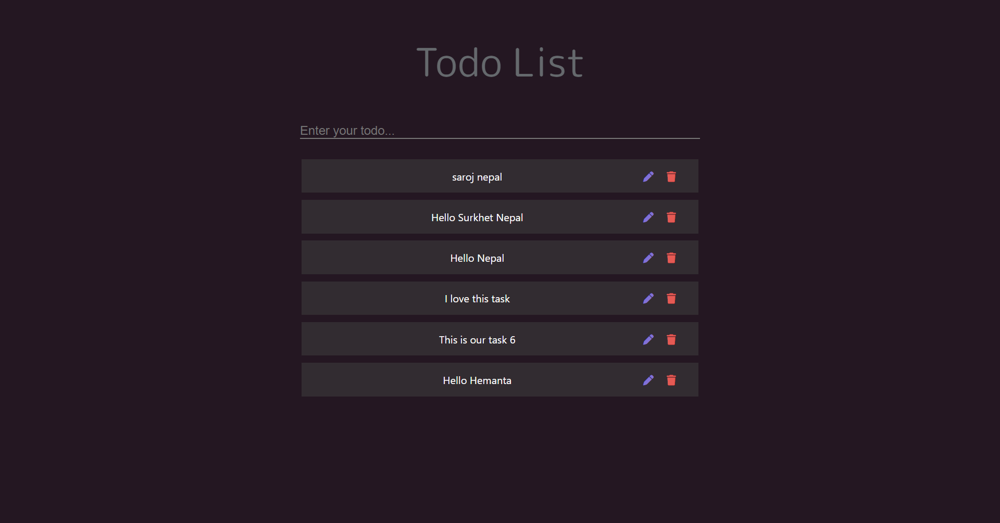

# Todo List

I created a web application for managing to-do lists using the MERN stack technology.

## Features

With the to-do list web app I developed using the MERN stack, you have the ability to add, edit, and delete tasks as well as view a list of your tasks

## Installation

Instructions on how to install and set up the project.

### Installation for Client

#### Commands

```bash
npm install
```

or

```bash
npm i react
npm i react-redux
npm i font-awesome
```

#### Env

### Installation for Server

#### Commands

```bash
npm install
```

or

```bash
npm i express
npm i cors
```

#### Env

```bash
DB_USERNAME:<username>
DB_PASSWORD:<password>
```

## API Endpoints

The following endpoints are available for interacting with the Todo API:

### `POST /todos`

Add a new Todo to the list.

#### Request

- Method: `POST`
- URL: `/todos`
- Body: JSON object containing the Todo details (title, description, done status)

#### Response

- Status: `201 Created`
- Body: JSON object containing the newly created Todo

### `GET /todos`

Get a list of all Todos.

#### Request

- Method: `GET`
- URL: `/todos`

#### Response

- Status: `200 OK`
- Body: Array of JSON objects containing all Todos

### `GET /todos/:id`

Get a single Todo by ID.

#### Request

- Method: `GET`
- URL: `/todos/:id`
- Parameters: `id` (string) - ID of the Todo to retrieve

#### Response

- Status: `200 OK`
- Body: JSON object containing the requested Todo

### `PUT /todos/:id`

Update an existing Todo by ID.

#### Request

- Method: `PUT`
- URL: `/todos/:id`
- Parameters: `id` (string) - ID of the Todo to update
- Body: JSON object containing the updated Todo details (title, description, done status)

#### Response

- Status: `200 OK`
- Body: JSON object containing the updated Todo

### `DELETE /todos/:id`

Delete a Todo by ID.

#### Request

- Method: `DELETE`
- URL: `/todos/:id`
- Parameters: `id` (string) - ID of the Todo to delete

#### Response

- Status: `204 No Content`

### screenshots


